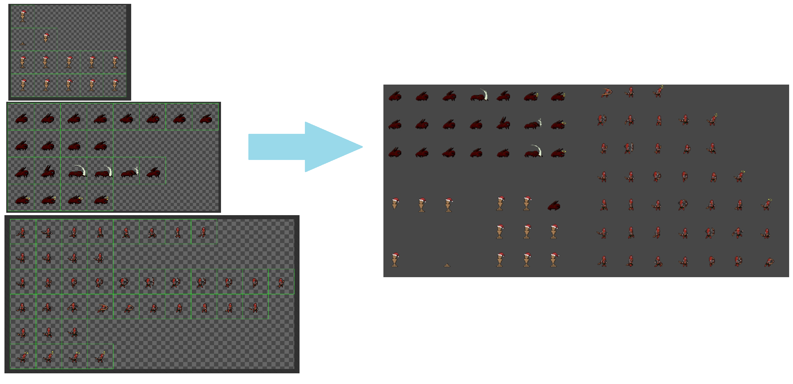

# Atlas Packer

**AtlasPacker** 这是一个Unity的运行时图集打包器，传入一系列uvrect及纹理进行打包。基于rendertexutre，支持动态添加uvrect和texutre进行重构。

## ✨ 特性

- 🚀 运行时支持
- 🧩 轻量，无第三方依赖

## 


### UvRect坐标系

从左下往右上扩散


### 实现方式

内部使用GL库绘制传入的uvrect及纹理到rendertexure

```csharp
_mtr_buf.SetTexture("_MainTex", _now_tx_source);
RenderTexture rtx = src.Tx;
GL.PushMatrix();
Graphics.SetRenderTarget(rtx);
GL.LoadProjectionMatrix(Matrix4x4.Ortho(0f, rtx.width, 0f, rtx.height, -1f, 100f));
MeshDrawer.RenderToGLMesh(_mesh_buf, _mtr_buf, _mesh_buf.TriangleCount);
Graphics.SetRenderTarget(null);
GL.PopMatrix();
_mesh_buf.Clear();
```

### 用法

```csharp
// =============atlasrect api
interface IAtlasRect 
{
    string id { get; }
    
    Texture tex { get; set; }
    
    int x { get; set; }
    
    int y { get; set; }
    
    int w { get; set; }
    
    int h { get; set; }
}

// ============uvrect typedefine
class yourAtlasRectStruct : IAtlasRect 
{
    ... // your implementation
}


// =============useage
// 构建uv表
IList<IAtlasRect> Auv;
...
    
// Auv传入uv表，在构建过程中会修改Auv内的uvrect
AtlasPacker.AtlasPacker.PackTexture(Auv, out RenderTexture rtx);
```